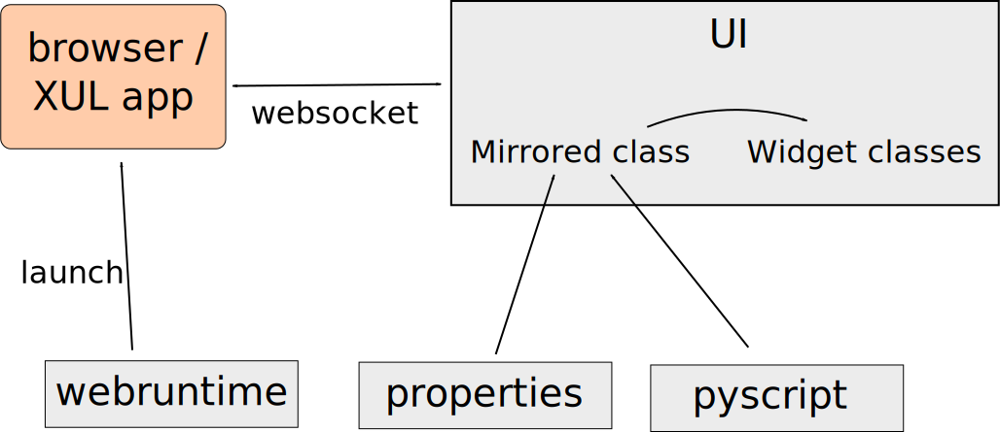

---------------
Getting started
---------------

Dependencies
------------

Flexx requires Python 3.3 or higher, and also supports Pypy3. Support
for legacy Python (version 2.7) *might* be considered for some components.

The ``react``, ``webruntime`` and ``pyscrip`` subpackages require no
dependencies. The ``app`` and ``ui`` subpackages require Tornado (a
pure Python package) and a browser. To run apps that look like desktop
apps, we recommend having Firefox installed.

Developers that want to run the tests need:

* pytest (a Python package, get it via conda or pip)
* flake8 (a Python package, get it via conda or pip)
* Nodejs
* Firefox

Current status
--------------

Flexx is in development and is in alpha status. Any part of the public
API may change without notice. Status of subpackages:
   
* The ``flexx.pyscript`` module is in a good state and has 100% test
  coverage. Needs methods for list/dict/str, but is otherwise very
  complete.
* The ``flexx.react`` module is in a good state, with good test
  coverage, but needs some work for functionals. 
* The ``flexx.webruntime`` module works well, but needs
  tests and should support more runtimes. 
* The ``flexx.app`` module is in a flux.
* The ``flexx.ui`` module is in a flux.

Installation
------------

* ``pip install flexx``
* ``pip install flexx[all]``  (will also install Tornado)
* Old school: ``python setup.py install``
* Clone the repo and add the root dir to your PYTHONPATH (developer mode)

Motivation
----------

The primary motivation for Flexx is the undeniable fact that the web
(i.e. browser technology) has become an increasingly popular method for
delivering applications to users, also for (interactive) scientific
content.

The purpose of Flexx is to provide a single application framework to
create desktop applications and web apps. By making use of browser
technology, the library itself can be relatively small and pure Python,
making it widely and easily available.

By making use of PyScript (Python to JavaScript translation), the entire
library is written without a line of JavaScript. This makes it easier
to develop than if we would have a corresponding "flexx.js" to maintain.
Further, it allows users to easily define callback methods that are
executed in JavaScript, allowing for higher performance when needed.

Libraries written for Python, but not *in* Python have a much harder
time to survive, because users don't easily become contributors. This
is one of the reasons of the success of e.g. scikit-image, and the
demise of e.g. Mayavi. Since Flexx is written in a combination of Python
and PyScript, its user community is more likely to take an active role
in the development.

Flexx overview
--------------

Flexx is designed to be modular, and this is reflected in the package
layout. The most commonly used subpackage is ``flexx.ui``. However, the
technologies on which it relies are defined in separate subpackages,
which are independent from each-other, and can be used by themselves.
E.g. ``import flexx.webruntime`` only imports that subpackage, and not
the whole ui toolkit and app framework (nor Tornado).

The image above outlines the structure of Flexx. The sole purpose of
the *webruntime* module is to launch a runtime to execute the app in.
This can be a browser, or a XUL application that looks like a desktop
app, or e.g. nodejs.
The *react* module provides functionality for reactive programming;
handling events via signals to let information flow through your
application.
The *pyscript* module provides a system for translating Python code to
JavaScript.
In the *app* module the app mainloop is defined, running the server to
which the web runtime connects (via a websocket). Further, it combines
the *react* and *pyscript* functionalities into the ``Model`` class;
a class for which its instances have a corresponding representation in
JavaScript. Signals are synced both ways, and it allows subclasses
to define methods for the JS version of the object in Python code (or
PyScript, to be precise). This is the base class for all widgets, but
could in principle also be useful in other situations where a tight
connection between Python and JS is required.
In the *ui* module all widgets are implemented.

In this documentation, we include a separate reference for each
subpackage. We recommend starting with the *ui* module, and not to worry
about the other modules until they're needed.

Notebooks
---------

There is a collection of 
`notebooks on Github <https://github.com/zoofIO/flexx-notebooks>`_.
The tutorial notebooks are also listed in the examples section of each
subpackage in the reference docs.

The notebooks containing widgets are best viewed live. Using the
nbviewer *should* also render them correctly, but this is somewhat
broken at this stage.
