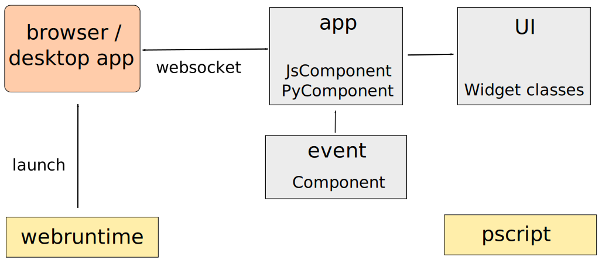

---------------
Getting started
---------------

Dependencies
------------

Being pure Python and cross platform, it should work (almost) anywhere
where there's Python and a browser.
Flexx is written for Python 3.5+ and also works on Pypy.
Flexx actively supports Firefox, Chrome and (with minor limitations) MS Edge.

Flexx further depends on:
    
* `Tornado <http://tornado.readthedocs.io>`_
* `PScript <http://pscript.readthedocs.io>`_
* `Webruntime <http://webruntime.readthedocs.io>`_
* `Dialite <http://dialite.readthedocs.io>`_

All are pure Python packages, and the latter three are projects under the
flexxui umbrella. Further, Flexx needs a browser. To run apps that look like
desktop apps, we recommend having Firefox installed.

Developers that want to run the tests need:

* pytest and pytest-cov (get them via conda or pip)
* flake8 (get it via conda or pip)
* Nodejs
* Firefox

Supported browsers
------------------

Flexx aims to support all modern browsers, including Firefox, Chrome and Edge.
Internet Explorer version 10 and up should work, but some things may be flaky.

Current status
--------------

Flexx is in development and is in alpha status. Any part of the public
API may change without notice.

Installation
------------

* ``conda install flexx -c conda-forge``
* ``pip install flexx``
* Old school: ``python setup.py install``
* Clone the repo and add the root dir to your PYTHONPATH (developer mode)

Motivation
----------

The primary motivation for Flexx is the undeniable fact that the web
(i.e. browser technology) has become an increasingly popular method for
delivering applications to users, also for (interactive) scientific
content.

The purpose of Flexx is to provide a single application framework to
create desktop applications and web apps. By making use of browser
technology, the library itself can be relatively small and pure Python,
making it widely and easily available.

By making use of PScript (Python to JavaScript translation), the entire
library is written without (hardly) a line of JavaScript. This makes it easier
to develop than if we would have a corresponding "flexx.js" to maintain.
Further, it allows users to easily define callback methods that are
executed in JavaScript, allowing for higher performance when needed.

Libraries written for Python, but not *in* Python have a much harder
time to survive, because users don't easily become contributors. This
is one of the reasons of the success of e.g. scikit-image, and the
demise of e.g. Mayavi. Since Flexx is written in a combination of Python
and PScript, its user community is more likely to take an active role
in its development.

Flexx overview
--------------

The image above outlines the structure of Flexx. 
The *event* module provides a powerful property and event system that
makes it easy to connect different parts of your application. Central to
the event system is the ``Component`` class.
The *app* module runs the server to which the web runtime connects (via a
websocket). Further, it extends the ``event.Component`` class into the
``PyComponent`` and ``JsComponent`` classes. Objects of these classes 
live in Python and JavaScript respectively, but (can) have a representation
on the other side, from which properties can be accessed, and actione be invoked.
The *ui* module defines all widgets (based on ``JsComponent``).

The external *webruntime* package is used to launch a browser looking like
a dektop app. The *pscript* library is used throughout Flexx to compile
Python code to JavaScript.
